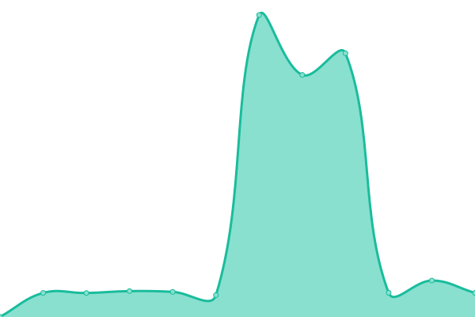

# [📈 Live Status](https://NatanaelGeraldoS.github.io/BINUSWeb): <!--live status--> **🟩 All systems operational**

This repository contains the open-source uptime monitor and status page for [Natanael Geraldo Sulaiman](https://NatanaelGeraldoS.github.io/BINUSWeb), powered by [Upptime](https://github.com/upptime/upptime).

With [Upptime](https://upptime.js.org), you can get your own unlimited and free uptime monitor and status page, powered entirely by a GitHub repository. We use [Issues](https://github.com/NatanaelGeraldoS/BINUSWeb/issues) as incident reports, [Actions](https://github.com/NatanaelGeraldoS/BINUSWeb/actions) as uptime monitors, and [Pages](https://NatanaelGeraldoS.github.io/BINUSWeb) for the status page.

<!--start: status pages-->
<!-- This summary is generated by Upptime (https://github.com/upptime/upptime) -->
<!-- Do not edit this manually, your changes will be overwritten -->
<!-- prettier-ignore -->
| URL | Status | History | Response Time | Uptime |
| --- | ------ | ------- | ------------- | ------ |
|  [Student Desk BINUS SCHOOL Serpong](https://serpong.binus-school.net/student/LoginBinusian.aspx) | 🟩 Up | [student-desk-binus-school-serpong.yml](https://github.com/NatanaelGeraldoS/BINUSWeb/commits/HEAD/history/student-desk-binus-school-serpong.yml) | 

 3569ms
     
 | 

<a href="https://NatanaelGeraldoS.github.io/BINUSWeb/history/student-desk-binus-school-serpong">99.73%</a>
    

|  [Parent Desk BINUS SCHOOL Serpong](https://serpong.binus-school.net/parent/LoginBinusian.aspx) | 🟩 Up | [parent-desk-binus-school-serpong.yml](https://github.com/NatanaelGeraldoS/BINUSWeb/commits/HEAD/history/parent-desk-binus-school-serpong.yml) | 

 1102ms
     
 | 

<a href="https://NatanaelGeraldoS.github.io/BINUSWeb/history/parent-desk-binus-school-serpong">99.73%</a>
    

|  [Staff Desk BINUS SCHOOL Serpong](https://serpong.binus-school.net/staffdesk/LoginBinusian.aspx) | 🟩 Up | [staff-desk-binus-school-serpong.yml](https://github.com/NatanaelGeraldoS/BINUSWeb/commits/HEAD/history/staff-desk-binus-school-serpong.yml) | 

 2235ms
     
 | 

<a href="https://NatanaelGeraldoS.github.io/BINUSWeb/history/staff-desk-binus-school-serpong">99.74%</a>
    

|  [LRC BINUS SCHOOL Serpong](http://serpong.binus-school.net/Library/) | 🟩 Up | [lrc-binus-school-serpong.yml](https://github.com/NatanaelGeraldoS/BINUSWeb/commits/HEAD/history/lrc-binus-school-serpong.yml) | 

 2896ms
     
 | 

<a href="https://NatanaelGeraldoS.github.io/BINUSWeb/history/lrc-binus-school-serpong">99.74%</a>
    

|  [CMS](http://cmsschool.binus.edu/) | 🟩 Up | [cms.yml](https://github.com/NatanaelGeraldoS/BINUSWeb/commits/HEAD/history/cms.yml) | 

 996ms
     
 | 

<a href="https://NatanaelGeraldoS.github.io/BINUSWeb/history/cms">99.75%</a>
    

|  [Beelajar](https://beelajar.apps.binus.edu/) | 🟩 Up | [beelajar.yml](https://github.com/NatanaelGeraldoS/BINUSWeb/commits/HEAD/history/beelajar.yml) | 

 1874ms
     
 | 

<a href="https://NatanaelGeraldoS.github.io/BINUSWeb/history/beelajar">99.75%</a>
    

|  [E-DESK](https://e-desk.binus.sch.id/) | 🟩 Up | [e-desk.yml](https://github.com/NatanaelGeraldoS/BINUSWeb/commits/HEAD/history/e-desk.yml) | 

 1275ms
     
 | 

<a href="https://NatanaelGeraldoS.github.io/BINUSWeb/history/e-desk">100.00%</a>
    

<!--end: status pages-->

[**Visit our status website →**](https://NatanaelGeraldoS.github.io/BINUSWeb)

## 📄 License

- Powered by: [Upptime](https://github.com/upptime/upptime)
- Code: [MIT](./LICENSE) © [Natanael Geraldo Sulaiman](https://NatanaelGeraldoS.github.io/BINUSWeb)
- Data in the `./history` directory: [Open Database License](https://opendatacommons.org/licenses/odbl/1-0/)
